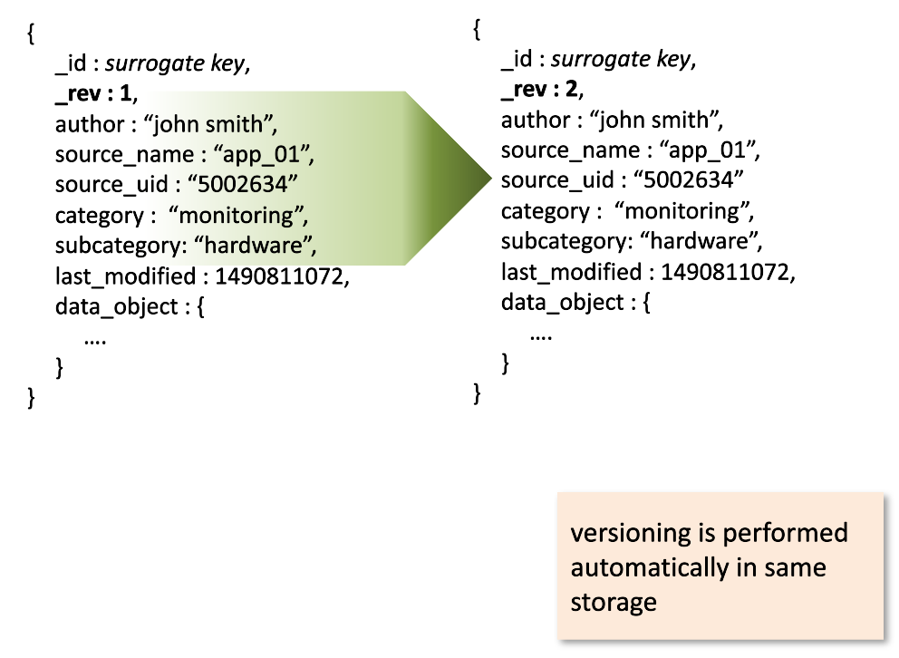

The Data as a Service (DaaS) pattern allows for the delivery of the Minimal Viable Product (MVP) for real-time data management, while avoiding many of the anti-patterns that traditional data provisioning and BI systems portray. Unlike traditional BI tooling, building out a DaaS system doesn't require high up-front costs and the welding of multiple products.

---

## High Level Architecture
The DaaS Pattern is the cobination of three logical components _Data Model_, _Processing_, and _Eventing_.

#### Data Model
> The data model mimics an envelope with metadata as the wrapper and the data object as the content.

#### Processing and Eventing
> The processing can be supported by microservices or serverless functions while the role of eventing is fulfilled by a broker.

---

### DaaS SDK
+ [Rust-Lang](https://crates.io/crates/daas)

---

### Conferences
+ [Uberconf](https://uberconf.com)
+ [ArchConf](https://archconf.com/)
