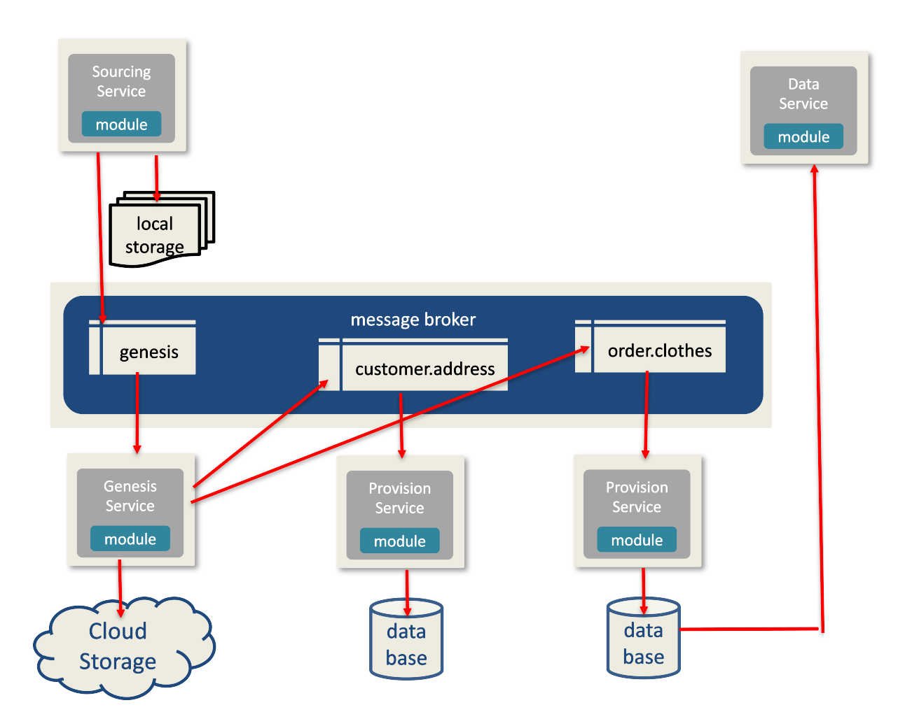

The Data as a Service (DaaS) pattern allows for the delivery of the Minimal Viable Product (MVP) for real-time data management, while avoiding many of the anti-patterns that traditional data provisioning and BI systems portray. Unlike traditional BI tooling, building out a DaaS system doesn't require high up-front costs and the welding of multiple products.

---

## High Level Architecture
The DaaS Pattern is the cobination of three logical components _Data Model_, _Processing_, and _Eventing_.

#### Data Model
> The _data model_ mimics an envelope with metadata as the wrapper and the data object as the content. Because of this data model, the orchestration of the eventing can be driven by the data and does not have to be preconfigured.

#### Processing and Eventing
> The _processing_ can be supported by microservices or serverless functions, while the role of _eventing_ is fulfilled by a broker. Since brokering supports the publish/subscribe pattern, a plugin model of data provisioning steps can be easily added/removed and it even allows for branched parallel processing on a singluar data message.  

---

### DaaS SDK
+ [Rust-Lang](https://crates.io/crates/daas)

---

### Conferences
+ [Uberconf](https://uberconf.com)
+ [ArchConf](https://archconf.com/)
